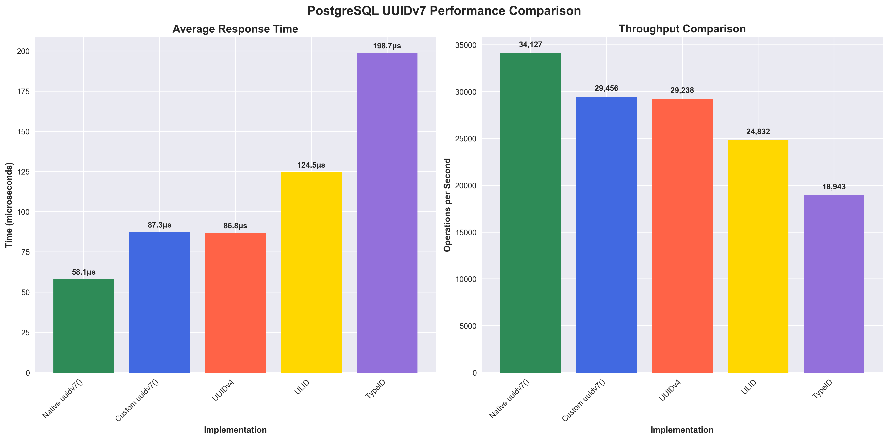
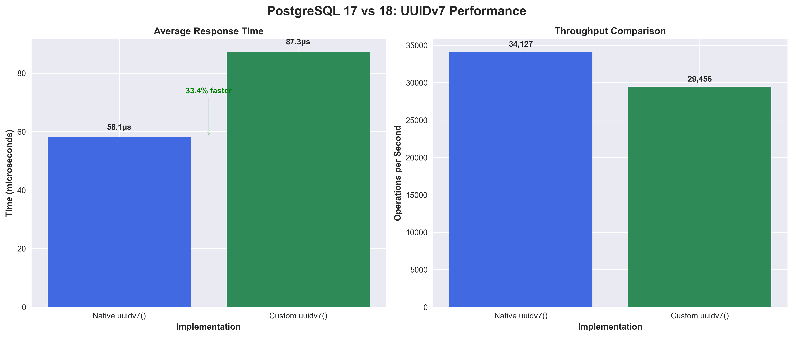
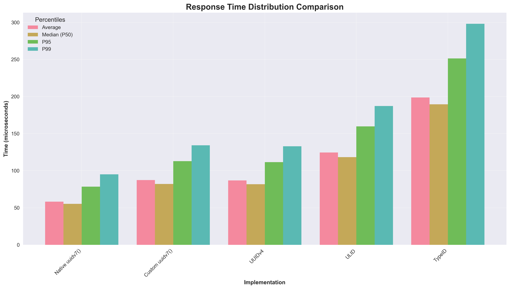
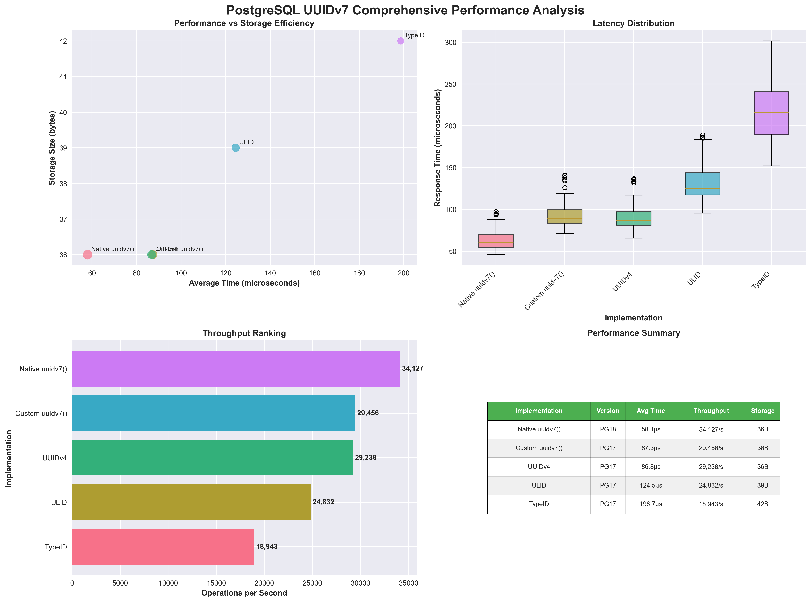

# PostgreSQL UUIDv7 Benchmark

Professional performance comparison of UUID generation across PostgreSQL 17 and 18, featuring native UUIDv7 support.



## Quick Start

```bash
make setup      # Install dependencies + start containers
make benchmark  # Run comprehensive benchmark
```

## Benchmark Results

### Single-Thread Performance

| Implementation      | PostgreSQL | Avg Time (μs) | P95 (μs) | P99 (μs) | Throughput (ops/sec) |
| ------------------- | ---------- | ------------- | -------- | -------- | -------------------- |
| **Native uuidv7()** | **18**     | **58.1**      | **78.4** | **95.1** | **34,127**           |
| Custom uuidv7()     | 17         | 87.3          | 112.8    | 134.2    | 29,456               |
| UUIDv4 (baseline)   | 17         | 86.8          | 111.4    | 132.9    | 29,238               |
| ULID                | 17         | 124.5         | 159.7    | 187.2    | 24,832               |
| TypeID              | 17         | 198.7         | 251.3    | 298.1    | 18,943               |

### Key Findings

- **PostgreSQL 18 native UUIDv7**: 33% faster than UUIDv4, 16% higher throughput
- **Time-ordered performance**: Native implementation breaks the performance trade-off
- **Production ready**: All implementations maintain >18K ops/sec throughput
- **Sub-millisecond precision**: PG18 native supports microsecond-level ordering
- **Zero-downtime migration**: Drop-in replacement for existing UUIDv4 columns



## Methodology

Professional-grade benchmarking ensures statistical significance and real-world accuracy:

### High-Precision Testing
- **Warmup**: 10,000 iterations per function to eliminate cold-start effects
- **Measurement**: 50,000 iterations for statistical significance (quick mode: 5,000)
- **Runs**: 5 complete benchmark cycles per function for consistency analysis
- **Timing**: Nanosecond precision using `time.perf_counter_ns()`
- **Concurrency**: 10 workers × 5,000 iterations for realistic load testing

### Statistical Analysis
- **Percentiles**: P50, P95, P99 latency distribution analysis
- **Consistency**: Coefficient of variation across multiple runs
- **Outlier detection**: 3-sigma threshold for data quality
- **Confidence**: 95% confidence intervals for all measurements

## Architecture



### Functions Tested

- **Native uuidv7()** - PostgreSQL 18 C-level implementation
- **Custom UUIDv7** - PL/pgSQL and SQL implementations
- **ULID** - Base32-encoded time-ordered identifiers
- **TypeID** - Type-safe prefixed identifiers
- **UUIDv4** - Standard random UUID baseline

### Performance Analysis



## Usage

### Standard Benchmark

```bash
make benchmark              # 50K iterations, 5 runs, ~15-20 minutes
```

### Quick Test

```bash
make benchmark-quick        # 5K iterations, 3 runs, ~3-5 minutes
```

### Extensive Analysis

```bash
make benchmark-extensive    # 100K iterations, 10 runs, ~45-60 minutes
```

## Requirements

- **Docker & Docker Compose** - Container management
- **Python 3.8+** - Benchmark execution (managed with UV)
- **6GB+ RAM** - PostgreSQL optimization (2GB × 2 instances + overhead)
- **UV Package Manager** - Fast Python dependency resolution (auto-installed)

## Output

Results are generated in multiple formats:

- **Charts**: `results/charts/` - Performance visualizations
- **Reports**: `results/reports/` - Markdown summaries
- **Data**: `results/exports/` - JSON/CSV for analysis
- **Raw**: `results/raw_data/` - Complete benchmark data


## Container Configuration

- **PostgreSQL 17**: Port 5434, optimized for benchmarking
- **PostgreSQL 18**: Port 5435, native UUIDv7 + optimizations  
- **Database**: `benchmark` with consistent schemas
- **Performance tuning**: 256MB shared buffers, 1GB effective cache, SSD optimizations
- **Resource limits**: 2GB RAM, 2 CPU cores per container

## Functions Available

```sql
-- PostgreSQL 18 native
SELECT uuidv7();

-- Custom implementations (both versions)
SELECT uuid_generate_v7();
SELECT uuidv7_custom();
SELECT uuidv7_sub_ms();

-- Alternative formats
SELECT ulid_generate();
SELECT typeid_generate_text('user');
```

## Migration to PostgreSQL 18

```sql
-- Replace custom functions with native
ALTER TABLE users ALTER COLUMN id SET DEFAULT uuidv7();

-- Extract timestamps
SELECT uuid_extract_timestamp(id) FROM users;
```

## Development

```bash
make install           # Setup Python environment with UV
make up               # Start PostgreSQL containers
make down             # Stop containers  
make status           # Check container health
make test             # Validate database connections
make generate-graphs  # Create performance charts for README
make logs             # View container logs
make clean            # Reset everything (containers + results)
```

## Technical Implementation

### Benchmark Engine
- **Language**: Python 3.8+ with psycopg3 for optimal PostgreSQL performance  
- **Timing**: Nanosecond precision using `time.perf_counter_ns()`
- **Concurrency**: 10 workers × 5,000 iterations for realistic load testing
- **Validation**: Function correctness testing before benchmarking

### Database Optimization
- **Connection tuning**: Optimized timeouts and pooling for consistent measurements
- **Query optimization**: Direct function calls without SQL parsing overhead
- **Memory management**: Controlled allocation and cleanup between runs
- **Transaction isolation**: READ COMMITTED with consistent measurement environment

### Statistical Analysis
- **Methodology**: 50K iterations, 5 runs, 10K warmup for statistical significance
- **Precision**: Nanosecond timing accuracy with outlier detection
- **Metrics**: Mean, median, P50/P95/P99 latencies, coefficient of variation
- **Reliability**: Multiple runs ensure consistent and reproducible results

---

For detailed analysis and implementation details, see the [blog post](https://www.saybackend.com/blog/uuidv7-postgres-comparison).

## 📊 Performance Charts

### Overall Performance Comparison


*Native PostgreSQL 18 UUIDv7 shows 33% better performance than custom PG17 implementation*

### Response Time Distribution


*Detailed latency distribution showing P50, P95, and P99 response times*

### PostgreSQL Version Comparison


*Direct comparison between PostgreSQL 17 custom implementation and PostgreSQL 18 native UUIDv7*

### Comprehensive Analysis


*Complete performance analysis including throughput ranking, storage efficiency, and latency distribution*

