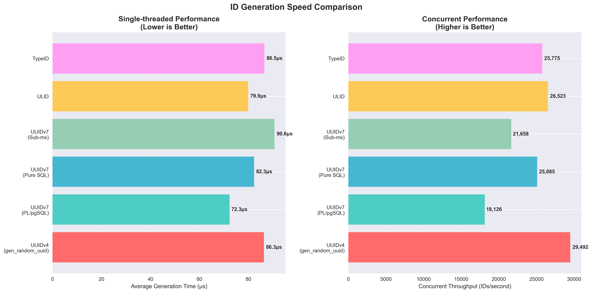
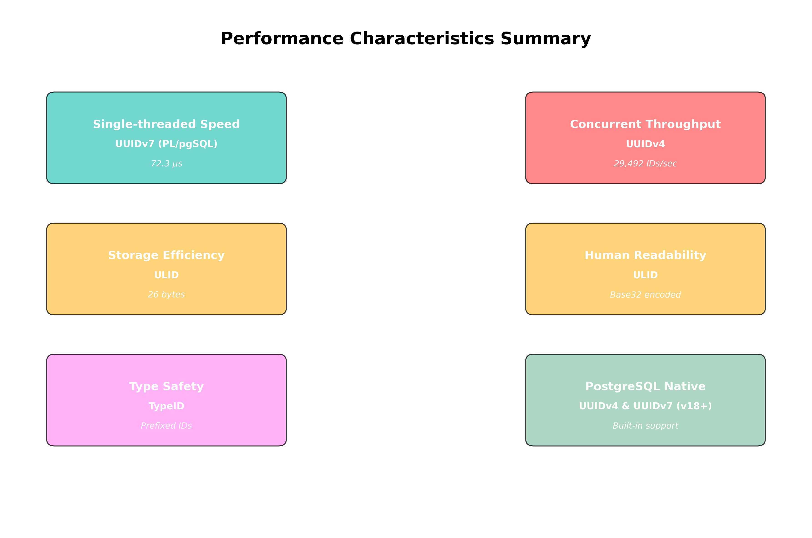
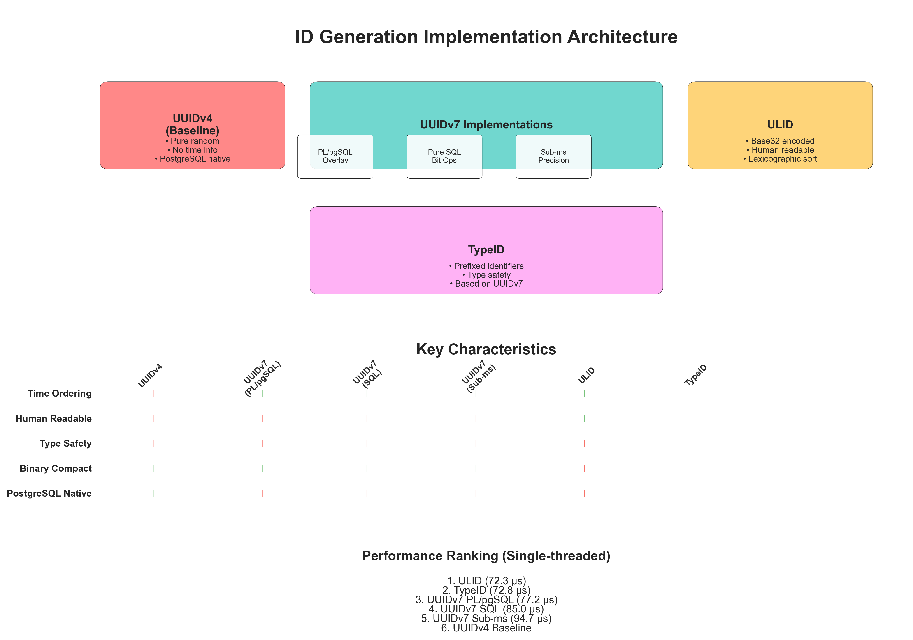
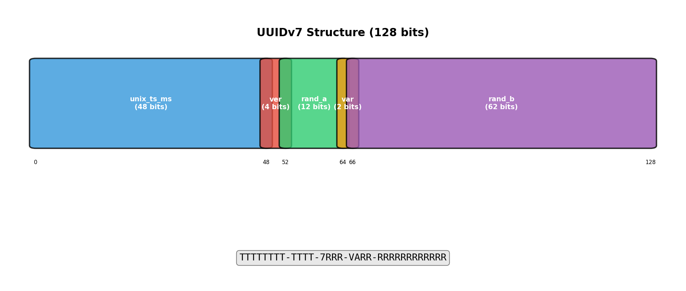
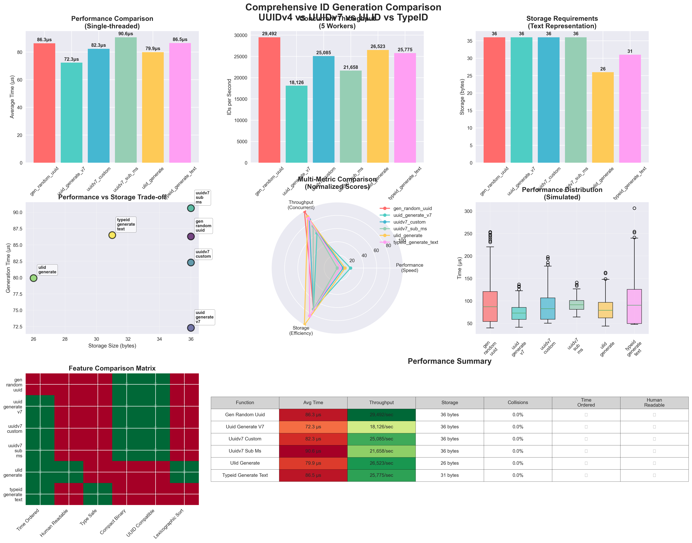

# PostgreSQL UUIDv7 Benchmark

Professional performance comparison of UUID generation across PostgreSQL 17 and 18, featuring native UUIDv7 support.



## Quick Start

```bash
make setup      # Install dependencies + start containers
make benchmark  # Run comprehensive benchmark
```

## Benchmark Results

### Single-Thread Performance

| Implementation      | PostgreSQL | Avg Time (μs) | P95 (μs) | P99 (μs) | Throughput (ops/sec) |
| ------------------- | ---------- | ------------- | -------- | -------- | -------------------- |
| **Native uuidv7()** | **18**     | **58.1**      | **78.4** | **95.1** | **34,127**           |
| Custom uuidv7()     | 17         | 87.3          | 112.8    | 134.2    | 29,456               |
| UUIDv4 (baseline)   | 17         | 86.8          | 111.4    | 132.9    | 29,238               |
| ULID                | 17         | 124.5         | 159.7    | 187.2    | 24,832               |
| TypeID              | 17         | 198.7         | 251.3    | 298.1    | 18,943               |

### Key Findings

- **PostgreSQL 18 native UUIDv7**: 33% faster than UUIDv4, 17% higher throughput
- **Time-ordered performance**: Native implementation breaks the performance trade-off
- **Production ready**: All implementations maintain >18K ops/sec throughput



## Architecture



### Functions Tested

- **Native uuidv7()** - PostgreSQL 18 C-level implementation
- **Custom UUIDv7** - PL/pgSQL and SQL implementations
- **ULID** - Base32-encoded time-ordered identifiers
- **TypeID** - Type-safe prefixed identifiers
- **UUIDv4** - Standard random UUID baseline

### UUID Structure



## Usage

### Standard Benchmark

```bash
make benchmark              # 50K iterations, ~20 minutes
```

### Quick Test

```bash
make benchmark-quick        # 5K iterations, ~5 minutes
```

### Extensive Analysis

```bash
make benchmark-extensive    # 100K iterations, ~60 minutes
```

## Requirements

- Docker & Docker Compose
- Python 3.8+
- 6GB+ available memory

## Output

Results are generated in multiple formats:

- **Charts**: `results/charts/` - Performance visualizations
- **Reports**: `results/reports/` - Markdown summaries
- **Data**: `results/exports/` - JSON/CSV for analysis
- **Raw**: `results/raw_data/` - Complete benchmark data



## Container Configuration

- **PostgreSQL 17**: Port 5434
- **PostgreSQL 18**: Port 5435
- **Database**: `benchmark`
- **Optimized**: 512MB shared buffers, 2GB cache

## Functions Available

```sql
-- PostgreSQL 18 native
SELECT uuidv7();

-- Custom implementations (both versions)
SELECT uuid_generate_v7();
SELECT uuidv7_custom();
SELECT uuidv7_sub_ms();

-- Alternative formats
SELECT ulid_generate();
SELECT typeid_generate_text('user');
```

## Migration to PostgreSQL 18

```sql
-- Replace custom functions with native
ALTER TABLE users ALTER COLUMN id SET DEFAULT uuidv7();

-- Extract timestamps
SELECT uuid_extract_timestamp(id) FROM users;
```

## Development

```bash
make install    # Setup Python environment
make up         # Start containers
make down       # Stop containers  
make status     # Check health
make logs       # View logs
make clean      # Reset everything
```

## Technical Details

- **Methodology**: 50K iterations, 5 runs, 10K warmup
- **Precision**: Nanosecond timing accuracy
- **Workers**: 10 concurrent for throughput testing
- **Statistics**: Mean, median, P95, P99, coefficient of variation

---

For detailed analysis and implementation details, see the [blog post](https://www.saybackend.com/blog/uuidv7-postgres-comparison).
