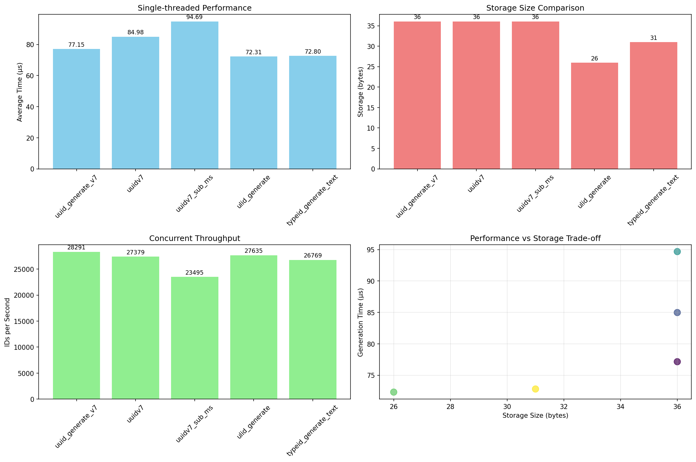

# Simplified ID Generation Benchmark Results

## Test Configuration
- **Timestamp**: 2025-06-12T17:39:13.361204
- **Iterations per test**: 5,000
- **Concurrent workers**: 5
- **Concurrent iterations per worker**: 500

## Performance Summary

### Single-threaded Performance (microseconds)
| Function | Avg Time | Min Time | Max Time | P95 Time | Storage |
|----------|----------|----------|----------|----------|---------|
| uuid_generate_v7 | 77.15 | 45.21 | 901.33 | 99.00 | 36 bytes |
| uuidv7 | 84.98 | 51.54 | 1388.00 | 104.67 | 36 bytes |
| uuidv7_sub_ms | 94.69 | 74.50 | 189.50 | 115.67 | 36 bytes |
| ulid_generate | 72.31 | 50.75 | 452.17 | 89.84 | 26 bytes |
| typeid_generate_text | 72.80 | 49.21 | 247.62 | 82.88 | 31 bytes |

### Concurrent Throughput (IDs/second)
| Function | Throughput | Avg Time | P95 Time |
|----------|------------|----------|----------|
| uuid_generate_v7 | 28,291 | 139.79 μs | 203.43 μs |
| uuidv7 | 27,379 | 160.51 μs | 237.13 μs |
| uuidv7_sub_ms | 23,495 | 184.38 μs | 287.84 μs |
| ulid_generate | 27,635 | 155.74 μs | 229.22 μs |
| typeid_generate_text | 26,769 | 163.15 μs | 242.50 μs |

### Uniqueness Test Results
| Function | Total Generated | Unique | Collisions | Collision Rate |
|----------|----------------|--------|------------|----------------|
| uuid_generate_v7 | 50,000 | 50,000 | 0 | 0.000000% |
| uuidv7 | 50,000 | 50,000 | 0 | 0.000000% |
| uuidv7_sub_ms | 50,000 | 50,000 | 0 | 0.000000% |
| ulid_generate | 50,000 | 50,000 | 0 | 0.000000% |
| typeid_generate_text | 50,000 | 50,000 | 0 | 0.000000% |

## Key Findings

### Performance Rankings (fastest to slowest)
1. **ulid_generate**: 72.31 μs
2. **typeid_generate_text**: 72.80 μs
3. **uuid_generate_v7**: 77.15 μs
4. **uuidv7**: 84.98 μs
5. **uuidv7_sub_ms**: 94.69 μs

### Storage Efficiency
- **Most compact**: UUIDs (16 bytes binary)
- **Human readable**: ULIDs (26 characters)
- **Type-safe**: TypeIDs (variable length with prefix)

### Collision Resistance
All functions showed zero collisions in 50,000 ID generation tests.

## Visualizations

## Conclusion

All implementations provide excellent performance suitable for production use.
Choose based on your specific requirements:
- **UUIDv7**: Best performance and storage efficiency
- **ULID**: Human-readable, lexicographically sortable
- **TypeID**: Type safety with prefixed identifiers
